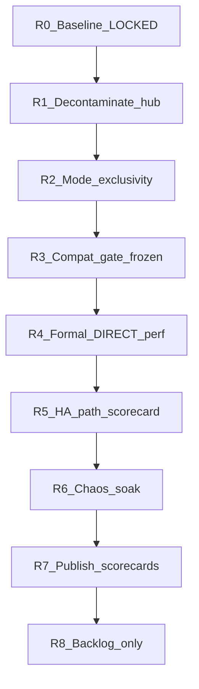

# Contabo 公平实验 · 分轮执行地图

**权威正式计划：** [`USER-METHOD-PLAN.md`](USER-METHOD-PLAN.md)（三阶段：双单机 API → 仅 Rust 集群 → 三节点双实现）。

下文 R0–R8（2026-08-03）为**历史基线 / 非正式**，不得冒充 USER-METHOD-PLAN 下的正式结论。  
工具与证据仍见 `tools/fairness-lab/`、`tools/test-results/fairness-lab-*-20260803/`。

---

## 总规则（每轮通用）

- **Stop 线**：该轮验收条全绿才允许开下一轮；未绿只修本轮，不叠新功能。
- **数字纪律**：`NOISY` / `HA-PATH` / `CORE-PATH` / `WARN` 不得散文洗白。
- **发布纪律**：证据 + docs +（需要时）Vercel/Drive 同轮提交；长测结束必出 HTML/Canvas。
- **硬约束**：无票不 wipe；不第二套 Keepalived；不发布密钥/jar。
- **R0 已锁（勿重做）**：工具/文档/降级标签已发布；compat-diff 11/11；chaos proxy-loss 20/20；正式 DIRECT-4PROXY 尚未跑。
- **R1 已绿（2026-08-03）**：hub → swift4；swift1 SAIO 停清；VIP 200。
- **R2 已绿（2026-08-03）**：`perf-rust` PASS；`PYTHON_CLUSTER_ABSENT`（Py formal 冻结）；destructive dry exit 3。
- **R3 已绿（2026-08-03）**：compat-diff 11/11；func VIP/SAIO 54/54；SAIO@swift3；shadow_peer→10.0.0.3:8090。
- **R4 已绿（2026-08-03）**：DIRECT-4PROXY Rust data-path/ISO-CONFIG 8 cells ≥8 runs；16MB_read **WARN**；Py formal 仍 FROZEN。
- **R5 已绿（2026-08-03）**：HA-PATH ONLY 分册 8 cells ≥8；部分 WARN/NOISY（与 soak 并发）。
- **R6 已绿（2026-08-03）**：proxy/object-loss ok=20；ha-test PASS；soak 1h fails=0。
- **R7 已绿（2026-08-03）**：四 scorecard + batch REPORT；见 `fairness-lab-R7-20260803/`。下一轮入口 = **R8 backlog only**。

---

## R0 — 基线锁定（已完成 · Stop 在此）

| | |
|--|--|
| **做了什么** | 三模式文档、CONFIG-PARITY、mode-switch/perf/chaos 骨架、数字降级、docs 标签 |
| **Stop** | 公开页已标 `NOISY`/`HA-PATH`；`docs-claim-audit` 绿 |
| **禁止** | 用旧 SAIO/VIP-only 当主结论 |

---

## R1 — 拆污染（已完成 · Stop 绿）

**目标**：实验干扰面离开 VIP MASTER。

| 项 | 内容 |
|----|------|
| 动作 | 监控/console 迁出 swift1 → **swift4**；双 SAIO 在 swift1 **停清**（重建延后 R3 前到 swift3）；Alloy → `10.0.0.4:3100`；memcached 属集群保留 |
| 交付 | `tools/test-results/fairness-lab-R1-20260803/HUB-CLEARED.md` + `before/`/`after/` ss |
| **Stop（验收）** | **GREEN** — swift1 无 `:8090/:8081`；Prom/console 在 swift4；VIP auth 200 |
| **未绿则** | 只回滚/重迁，不开 R2 formal |
| 预计干扰 | 需维护窗；短时监控空窗可接受 |

---

## R2 — Performance 模式独占机械（已完成 · Stop 绿）

**入口**：R1 Stop 绿。

| 项 | 内容 |
|----|------|
| 动作 | 实跑 `mode-switch.sh perf-rust` / `perf-python`；固化 SAIO 停清 + `gate_perf_rust`；`PYTHON_CLUSTER_ABSENT` 拒拆 Rust；destructive dry；`RING-12-FLOW.md` |
| 交付 | `tools/test-results/fairness-lab-R2-20260803/R2-MODE-GATE.md` |
| **Stop** | **GREEN** — `MODE_GATE=PASS expect=perf-rust`；Py formal **FROZEN** |
| **禁止** | 在仍有双实现残留监听时开 R4 |

---

## R3 — Compatibility 门禁冻结

**入口**：R2 Stop 绿（至少 Rust 独占可证）。

| 项 | 内容 |
|----|------|
| 动作 | 在非 hub 污染布局下重跑 `compat-diff` + `func-suite`（VIP + 双方 SAIO 若仍保留）；刷新 unsupported 表 |
| 交付 | `compatibility/SUMMARY.json`（新日期） |
| **Stop** | **GREEN** — L1 CORE-PATH fail=0（`fairness-lab-R3-20260803`） |
| **未绿** | 全部 Performance 标 `NON_EQUIVALENT`，**禁止 R4 主结论** |

---

## R4 — 正式性能主结论（DIRECT-4PROXY）· 最重一轮

**入口**：R3 Stop 绿 + R2 独占绿。

| 项 | 内容 |
|----|------|
| 动作 | 单实现占满 12 盘；客户端非 MASTER；入口直连 `10.0.0.1–4:8085`；`DATA-PATH` 与 `PRODUCTION-COMPLETE` 分跑；`ISO-CONFIG` 先于 `ISO-RESOURCE`；warm-up 丢弃；**A-B-B-A，每 cell ≥8 measured runs**；run 级 median + 95% CI |
| 首轮 workload 最小集 | 1KiB / 64KiB / 1MiB / 16MiB 的 PUT+GET 关键并发阶梯；另 4KB_write_128 作与历史 HA-PATH 对照（对照不升格） |
| 交付 | `fairness-lab-R4-*/` 全 run 目录 + Performance scorecard 初稿 |
| **Stop** | **GREEN with WARN** — 8/8 cells ≥8；16MB_read WARN；主表 DIRECT only（`fairness-lab-R4-20260803`） |
| **本轮明确不做** | VIP 主表、SAIO 吞吐主表、L3b、完整 ansible 插件实现 |

---

## R5 — HA-PATH 独立记分（不污染主表）

**入口**：R4 Stop 绿（或 R4 进行中可并行采集，但报告必须分册）。

| 项 | 内容 |
|----|------|
| 动作 | VIP `10.0.0.10:8085` 同 workload 子集；与 R4 分文件 |
| **Stop** | **GREEN with WARN/NOISY** — HA-PATH ONLY 分册（`fairness-lab-R5-20260803`）；不与 DIRECT 混比 |

---

## R6 — Chaos + Soak

**入口**：R4 至少完成 Rust `PRODUCTION-COMPLETE` 一轨（推荐双实现都有 formal 后再比收敛）。

| 项 | 内容 |
|----|------|
| 动作 | proxy-loss（已有）、object-loss、vip-master（ha-test）、按需 node-loss；每场景 ≥5 次；Soak ≥1 窗/实现（目标 6h，可先 1h 冒烟再拉长） |
| **Stop** | **GREEN** — chaos ok=20 + ha-test PASS；soak 1h fails=0（`fairness-lab-R6-20260803`） |

---

## R7 — 四 Scorecard 终稿 + 三方发布

**入口**：R4 主表 + R6 最小 chaos 绿。

| 项 | 内容 |
|----|------|
| 交付 | Compatibility / Correctness / Performance / Efficiency 四卡填满；HTML+Canvas；Git+Vercel+Drive；`SYNC-MANIFEST` |
| **Stop** | **GREEN** — `fairness-lab-R7-20260803/REPORT.html` + `FOUR-SCORECARDS.json`；能说/不能说已写明 |

---

## R8 — 验证项完成 · 实现项另立

| 项 | 状态 |
|----|------|
| 16MB_read retune（oc=40 / rt=180）+ formal ≥8 DIRECT/HA | **GREEN ACCEPT**（两册） |
| Soak 6h Rust DIRECT | **GREEN** fail_total=0（12 chunks） |
| L3b sharding | 未开（需独立 feature 轮） |
| Paste pipeline / memcache / servers_per_port | 未开（见 `blocked-by-missing-impl.md`） |
| Python formal 4 节点集群 | 仍 **FROZEN** |
| 监控专用机 / 双 bench | 未开（硬件/采购） |

证据：`tools/test-results/fairness-lab-R8-20260803/R8-GATE.md`

---

## 你怎么按轮验收（最短清单）

| 轮次 | 你看什么就算「这轮停了」 |
|------|--------------------------|
| R0 | 已停：标签+工具在 Git/Vercel |
| R1 | `HUB-CLEARED.md`：swift1 无 SAIO/Prom 共置 |
| R2 | 四节点残留检查：独占模式对方=0 |
| R3 | compat SUMMARY `gate=PASS` |
| R4 | Performance 主表只有 DIRECT-4PROXY，且每 cell ≥8 runs |
| R5 | HA 册独立，无混写 |
| R6 | chaos/soak 证据包 |
| R7 | 四 scorecard 终稿 URL + Drive |
| R8 | 另开 plan，不在本地图内执行 |

---

## 当前指针

- **正式主线**：[`USER-METHOD-PLAN.md`](USER-METHOD-PLAN.md)（R0–R8 = 历史基线 / 非正式）
- **阶段 2（2026-08-04）**：补全见 `tools/test-results/phase-2-20260804/REPORT.html`（VIP PASS / DIRECT WARN / chaos PASS / soak）
- **阶段 3（2026-08-04）**：Python 三节点 **FROZEN** — `tools/test-results/phase-3-20260804/`
- **历史 R8 Stop**：仍有效作基线；实现类 backlog 另立
